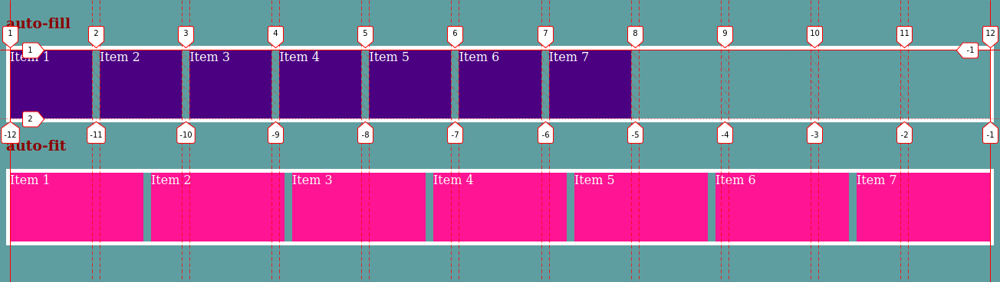

# Display Grid

En la sección anterior vimos [flexbox](https://github.com/uqbar-project/css-05-display-flexbox), y todo lo que nos otorgaba como modelo de layout. En este apartado nos toca presentar otro modelo de layout, **Display Grid**. Con él vamos a poder diseñar layouts basados en _"rejillas"_, sistemas que posiblemente nos resulten conocidos, por frameworks como [Bootstrap](https://getbootstrap.com/), [Foundation](https://get.foundation/), [Bulma](https://bulma.io/), entre otros. La gran diferencia es que Display Grid, es un estándar, lo que hace que podamos aplicarlo desde CSS (por medio de atributos, valores, funciones y unidades), manteniendo nuestros HTML sin la necesidad de _"ensuciarlos"_ con clases con nombres raros, y tampoco agregar peso a nuestro CSS con código de clases que posiblemente no utilicemos.
Además, una página con Grid Layout resulta sencilla de mantener y de aplicar otras herramientas de CSS3 como las [media queries](https://github.com/uqbar-project/css-10-media-queries).

## Conceptos importantes

Antes de empezar a ver ejemplos, es necesario que incorporemos algunos conceptos.


### Grid Context: Grid Container y Grid Item

Al elemento que le apliquemos la propiedad `display:grid` o `display:inline-grid`, hará de _"rejilla/contenedor"_ y es el que conocemos como **Grid Container**, y cada uno de los elementos (directos) que se encuentren dentro serán nuestros **Grid Items**. Esta relación _parent/children_ define al **Grid Context**.

### Grid Line

Son las líneas divisoras que componen la cuadrícula.
Estas pueden ser verticales (**Grid Line Column**) u horizontales (**Grid Line Row**). En nuestra imagen remarcamos un ejemplo con color rojo.
Vamos a referirnos a ellas, por **números** o por **nombres**.

### Grid Track

Es el nombre genérico que le damos a las **Grid Columns** o **Grid Rows**. Son el espacio horizontal o vertical entre dos `Grid Lines` **consecutivas**.
Definen el alto y ancho de la cuadrícula.

### Grid Cell

Es la **intersección** entre una `Grid Column` y una `Grid Row`, es decir el espacio entre **cuatro** `Grid Lines`. Siendo la unidad más pequeña para colocar un `Grid Item`.

### Grid Area

Es cualquier porción de la cuadrícula contenida entre **cuatro** `Grid Lines`, pudiendo contener **_n_** números de `Grid Cells`.

## El ejemplo

Para realizar el ejemplo final, primero vamos a ver ejemplos más específicos, que nos van a permitir conocer de forma más fácil, las posibilidades que brinda **Grid**, para diseñar nuestros layouts.


## Crear Grid Context

Empecemos creando un **Grid Container** y sus respectivos **Grid Items**.

En nuestro archivo `html` escribimos:

```html
<main>
  <div>1</div>
  <div>2</div>
  <div>3</div>
  <div>4</div>
  <div>5</div>
  <div>6</div>
  <div>7</div>
  <div>8</div>
  <div>9</div>
  <div>10</div>
</main>
```

y para convertir al `main` en un grid container le agregamos `display:grid` en el `css`.

```css
main {
  height: 100vh;
  background-color: cadetblue;
  display: grid;
}
```

y solo para identificar nuestros `grid items` ponemos:

```css
div {
  background-color: indianred;
  text-align: center;
  color: white;
}
```

### Creando columnas y filas

Bien, por ahora, no notamos grandes cambios, parecería que nuestros ítems siguen con un _display block_. Para ver que no es así, añadimos al grid container la propiedad **gap** que acepta unidades de medidas, y es propia del **Display Grid**.

en el `css`

```css
main {
  /* ... */
  gap: 2px;
}
```

Con esta inclusión, especificamos el tamaño de las `grid lines` y nos permite notar la _rejilla_ generada.
**gap** es una propiedad abreviada de **row-gap** y **column-gap**.


**Nota:** Anteriormente se usaba **grid-gap**, **grid-row-gap** y **grid-column-gap**, pero el prefijo **grid-** fue deprecado, no obstante por el momento siguen funcionando.


Sigamos, implementemos **grid-template-columns**. Con esta propiedad, vamos a poder definir de forma **explícita**, el ancho y cantidad de columnas de nuestra _cuadrícula_. Los valores que acepta, son de unidades de medidas.
¿Cómo la usamos? ... `grid-template-columns: 200px 200px` por ejemplo, configura nuestra rejilla a **dos** columnas de **200 píxeles** cada una.

De igual forma usamos **grid-template-rows**, para también definir las filas **explícitas**.

```css
main {
  /* ... */
  grid-template-columns: 200px 200px;
  grid-template-rows: 100px 100px 100px 100px 100px;
}
```

Observemos el resultado.


También podríamos haber usado la propiedad abreviada **grid-template** indicando filas y columnas de esta forma:

```css
main {
  /* ... */
  grid-template: 100px 100px 100px 100px 100px / 200px 200px;
}
```

Posiblemente, se estén preguntando, ¿Pero si necesito 10 columnas, voy a tener que escribir 10 veces el tamaño?.
Por suerte existe la función **repeat()**.

Reescribamos nuestro ejemplo, usando `repeat()`, y agreguemos una columna más.

```css
main {
  /* ... */
  grid-template: repeat(5, 100px) / repeat(3, 200px);
}
```

## Empecemos a ubicar los Grid Items

### Grid Lines por número

Abramos las herramientas que nos brinda el navegador _Mozilla Firefox_ como lo hacemos en la siguiente imagen.


En el _inspector de DOM y estilos_, buscamos al **grid container** en nuestro caso es el `main`, activamos la opción _grid_ para que nos muestre la grilla.

De esta forma podemos ver las **grid-lines** y cómo son numeradas dentro de nuestro contexto.

Queremos que el ítem 10, se desplace hacia la derecha, debajo del item 8 y 9. Además, necesitamos que llegue hasta el final de la grilla.

Entonces, pasando en limpio y basándonos en las `grid lines` que tenemos visibles en el navegador, queremos que el **item 10** se posicione desde la `grid line column 2` hasta la `grid line column 4`. Y desde la `grid line row 4` hasta la `grid line row 6`.

Para eso en el `css`, y ubicándonos en el **_item 10_**, necesitamos escribir las propiedades **grid-column-start**, **grid-column-end**, **grid-row-start** y **grid-row-end**
(y algunos estilos para resaltar nuestro item).

```css
div:nth-child(10) {
  color: black;
  background-color: gold;
  grid-column-start: 2;
  grid-column-end: 4;
  grid-row-start: 4;
  grid-row-end: 6;
}
```

De forma similar queremos que el **item 7** llegue hasta el final de la grilla, pero en vez de decirle que llegue hasta el `grid line row 6`, le vamos a decir que lo haga hasta `grid line row -1`
Aprovechamos e introducimos la propiedad abreviada **grid-row** para indicar las grid lines de `inicio / fin` .

```css
div:nth-child(7) {
  color: black;
  background-color: chartreuse;
  grid-row: 3/-1;
}
```

Podemos notar la diferencia entre indicar la grid line como **-1** en vez de **6** en la siguiente imagen.


Cuando agregamos una fila más, el _item 7_ sigue estando hasta el final de nuestra grid, mientras que al _item 10_ no le ocurre lo mismo.
Esto nos puede servir, cuando tengamos elementos que querramos que se ubiquen hasta el final siempre, si en un futuro se agregan mas filas (o columnas) no va a ser necesario volver a especificar su terminación.

Si preferimos, definir cuántás **grid tracks** queremos que se expandan los **grid items**, podemos usar como valor `span`, esto lo expande de forma relativa a donde estén ubicados.

Por ejemplo...

```css
div:nth-child(7) {
  color: black;
  background-color: chartreuse;
  grid-row: 3 / span 3;
}
```

### Grid Lines por nombre

Hay veces que vamos a necesitar referenciarnos de forma más _expresiva_. En estos casos, podemos darle **nombres** a las Grid Lines.

Hagamos un nuevo ejemplo, en el que tenga más sentido este modo de referenciarnos.

Realicemos un layout básico de este estilo ...


En el `html` ponemos

```html
<main>
  <header>Header</header>
  <nav>Menu</nav>
  <article>Contenido</article>
  <footer>Footer</footer>
</main>
```

y en el `css`

```css
main {
  height: 100vh;
  background-color: cadetblue;
  display: grid;
  gap: 5px;
  grid-template-columns: 20% 80%;
  grid-template-rows: 10% 40% 40% 10%;
}

main > * {
  background-color: indianred;
  text-align: center;
  color: white;
}
```

Entonces, tenemos 2 columnas y 4 filas.
Si nos damos cuenta, el cálculo de las `grid lines columns` siempre es **_cantidad de columnas + 1_**. De igual forma para las `grid lines rows`, pero considerando las filas.

Concentrémonos en el caso de las columnas. Podemos nombrar a `3 grid lines`.
Para ello hay que encerrar el nombre que le queremos asignar, entre corchetes `[nombre-elegido]`.
Es más fácil verlo en el `css`.

```css
main {
  /* ... */
  grid-template-columns: [menu-start] 20% [menu-end contenido-start] 80% [contenido-end];
  /* ... */
}
```

Esto nos clarifica, cómo se crean las columnas, declarando el ancho entre `grid lines`.

Sería `[nombre-grid-line]` `ancho-en-unidad-de-medida` `[nombre-otro-grid-line]`

**Nota 1:** es posible nombrar de varias formas una misma `grid line`, como vemos en el ejemplo con _menu-end_ y _contenido-start_.

**Nota 2:** darle nombre a las `grid lines`, no inhabilita seguir referenciándolas con los _números_ como vimos [antes](#Grid-Lines-por-número). Es más, no es obligatorio que le demos nombres a todas. Podríamos combinar _nombres_ y _números_.

Para las filas es exactamente lo mismo.
Reescribimos en el `css` las filas, y para empezar a identificar las `grid lines rows` lo escribimos de esta manera:

```css
main {
  /* ... */
  grid-template-rows:
    [header-start]
    10%
    [header-end contenido-start]
    40%
    [menu-end]
    40%
    [footer-start]
    10%
    [footer-end];
}
```

Listo, ya nombramos las grid lines, pasemos a indicarle a los `grid items` cómo ubicarse en la grilla.

Nos gustaría que el `header` comience a la misma altura que el menu, y finalice donde termine el contenido.

Digámosle al `css` eso mismo.

```css
header {
  grid-column: menu-start/ contenido-end;
}
```

Notemos cómo hacemos uso de la expresividad.
Cuando terminemos este ejemplo, vamos a poder _"leer"_ el `css` y entender cómo se ubica cada uno de nuestros items.

Terminemos el ejemplo ...

```css
nav {
  grid-row: header-end / menu-end;
}

article {
  grid-row: contenido-start / footer-start;
}

footer {
  grid-column: menu-start / contenido-end;
  grid-row: footer-start / footer-end;
}
```

Como resultado tenemos


### La Unidad fr

Ya dijimos que las **Grid Tracks** se pueden definir usando cualquier unidad de medida. Grid también introduce una unidad de longitud adicional para ayudarnos a crear **Grid Tracks** flexibles.¿Cuál? La nueva unidad **fr**, que representa **una fracción del espacio disponible en el contenedor** de la cuadrícula.
Avanzando en la lectura, vamos a ver cómo **fr** va a ser muy importante para el diseño de grillas flexibles.
Por el momento, modifiquemos el ejemplo para comenzar a utilizarla.

```css
main {
  /* ... */
  grid-template-columns: [menu-start] 1fr [menu-end contenido-start] 4fr [contenido-end];
  grid-template-rows:
    [header-start]
    1fr
    [header-end contenido-start]
    4fr
    [menu-end]
    4fr
    [footer-start]
    1fr
    [footer-end];
}
```

**Nota :** aprovechamos la oportunidad, para comentar que no hay nada que nos impida definir las `grid tracks` combinando las distintas unidades de medidas que conocemos.

### Grid Area

En la [imagen](#Conceptos-importantes) del comienzo vimos y luego explicamos lo que es una **Grid Area**, solo nos falta saber la forma de implementarlas.

Primero nos disponemos a definir a qué área va a corresponder cada elemento, utilizando la propieadad **grid-area**. Continuando con el último [ejemplo](#Grid-Lines-por-nombre), reemplazamos lo siguiente.

```css
header {
  grid-area: header;
}

nav {
  grid-area: menu;
}

article {
  grid-area: contenido;
}

footer {
  grid-area: footer;
}
```

Si llegáramos a actualizar la vista en el navegador, tendríamos los `grid items` ubicados por cualquier parte. Esto es porque falta decirle al `grid container` cómo queremos que los posicione.

Añadimos en la regla del selector `main` del `css`, una nueva propiedad, **grid-template-areas**.

```css
main {
  /* ... */
  grid-template-areas:
    "header  header"
    "menu    contenido"
    ".       contenido"
    "footer  footer";
}
```

Observando detenidamente, vamos a notar cómo la grilla cuenta con 4 filas y 2 columnas.
Donde en la primer fila queremos que se ubique el área `header` ocupando las 2 columnas.
En la segunda fila tenemos al `menu` solo en la primer columna, y parte del `contenido` en la segunda columna.
La tercer fila tiene como particularidad, un _"punto"_, con él, le decimos a Grid, que deje la `grid cell` vacía. Luego especificamos que en la 2da columna también hay parte del `contenido`.
Por último en la cuarta fila, declaramos al `footer`, en ambas columnas.
¿Qué es lo que hicimos? ... le indicamos a Grid, _celda_ por _celda_, qué **área**, queríamos que ubique.

Podríamos dejar acá la explicación de **Grid Area**, pero nos gustaría ir un poco más allá y ver cómo se produce la _"magia"_.

- Cuando usamos **grid-template-areas**, las líneas en cada extremo de las áreas se nombran automáticamente.
  En nuestro ejemplo, al nombrar un área como **footer**, el nombre de la línea de fila inicial y la línea de columna inicial del área será **footer- start** , y el nombre de su última línea de fila y última línea de columna será **footer- end**.

- El **grid-area**, que escribimos en los `grid items`, alternativamente, se puede usar como una abreviatura aún más corta para `grid-row-start` + `grid-column-start` + `grid-row-end` + `grid-column-end`. Es decir que podríamos utilizarla, para ubicar elementos, con [números de linea](#Grid-Lines-por-número) y [nombres de linea](#Grid-Lines-por-nombre)

Bien, hechos estos dos comentarios, vemos que modificando el `css`, eliminando los nombres de línea que especificamos manualmente, y en los `grid items` en vez de definir el área usamos **grid-column** y **grid-row**, llegamos al mismo resultado.

El `css` debería quedar así:

```css
main {
  /* ...*/

  grid-template-columns: 1fr 4fr; /* borramos los nombres de líneas*/
  grid-template-rows: 1fr 4fr 4fr 1fr; /* borramos los nombres de líneas*/

  grid-template-areas:
    "header  header"
    "menu    contenido"
    ".       contenido"
    "footer  footer";
}

/*  Otras reglas  */

header {
  grid-column: menu-start/ contenido-end;
}

nav {
  grid-row: header-end / menu-end;
}
article {
  grid-row: contenido-start / footer-start;
}

footer {
  grid-column: menu-start / contenido-end;
  grid-row: footer-start / footer-end;
}
```

## Límites y Patrones

Es probable que en alguna oportunidad necesitemos establecer **límites** a las `grid tracks`. Para eso existe la función **minmax()**, que toma dos parámetros, _min_ y _max_.

Cada parámetro puede ser cualquier `unidad de medida` o uno de los valores de las palabras claves `max-content`, `min-content` o `auto`.

Si _max < min_, entonces _max_ es ignorado y se trata a minmax(min,max) como _min_.

Hagamos un nuevo ejemplo que nos permita apreciar mejor esta función.

En el `html`

```html
<main>
  <div>Item 1</div>
  <div>Item 2</div>
</main>
```

```css
* {
  box-sizing: border-box;
  background-color: cadetblue;
}

main {
  height: 100vh;
  display: grid;
  gap: 5px;
  grid-template-columns: repeat(
    2,
    minmax(400px, 1fr)
  ); /* Establecemos un ancho minimo de 400px y max 1fr*/
}

main > * {
  background-color: indianred;
  text-align: center;
  color: white;
}
```

Vemos cómo se comporta


Efectivamente, las dos columnas que definimos, cuando el contenedor tiene un espacio mayor a 805px (considerando los 5px de gap), adaptan su ancho, haciendo uso de la unidad **1fr**, es decir utilizan el máximo espacio disponible y se lo distribuyen.
Una vez que el contenedor se reduce a un valor inferior a los 805px, es cuando empieza a trabajar el _min_ de **400px**, vemos incluso como las `grid lines columns`, acompañan la adaptabilidad hasta llegar a quedarse estáticas justo cuando alcanzamos el valor mínimo.

Con `repeat()` y `minmax()`, es fácil diseñar **patrones**.

Si tuviésemos que definir 8 columnas, pero que sean:

1.  Primer columna sea de 100px.
2.  Segunda de 50px mínimo y 100px máximo.
3.  Tercera siempre ajustada a su contenido.
4.  Cuarta como mínimo 80px y máximo lo que reste del espacio del contenedor.

y este _patrón_ queremos que se repita **dos veces** en total.

Para verlo cambiamos el `html` agregando más items y el `css` para definir el patrón.

```html
<main>
  <div>Item 1</div>
  <div>Item 2</div>
  <div>Item 3</div>
  <div>Item 4</div>
  <div>Item 5</div>
  <div>Item 6</div>
  <div>Item 7</div>
  <div>Item 8</div>
</main>
```

```css
main {
  /* ... */
  grid-template-columns: repeat(
    2,
    100px minmax(50px, 100px) minmax(min-content, max-content) minmax(80px, 1fr)
  );
}
```


Las columnas de los Items **_n_** se comportan de igual manera que las de los Items **_n + 4_**, por ejemplo la del _Item 1 e Item 5_.

**Nota :** al igual que vimos cuando [nombramos líneas](#Grid-Lines-por-nombre), dentro de los `repeat()`, también podemos hacerlo.

## Grid Dinámicas: auto-fill y auto-fit

Es posible que en ocasiones querramos que nuestras grillas se comporten de forma dinámica.
Para ello tenemos que utilizar la función `repeat()`, combinada (según el efecto deseado) con **auto-fill** o **auto-fit**.

Bajo algunas circunstancias **auto-fill** y **auto-fit** se van a comportar de igual forma, mientras que en otras no. ¿De qué va a depender? de la cantidad de `grid items` y el ancho del contenedor.

Entonces, veamos un nuevo ejemplo para determinar cuáles son las diferencias.

En el html

```html
<section class="auto-fill">
  <div>Item 1</div>
  <div>Item 2</div>
  <div>Item 3</div>
  <div>Item 4</div>
  <div>Item 5</div>
  <div>Item 6</div>
  <div>Item 7</div>
</section>

<section class="auto-fit">
  <div>Item 1</div>
  <div>Item 2</div>
  <div>Item 3</div>
  <div>Item 4</div>
  <div>Item 5</div>
  <div>Item 6</div>
  <div>Item 7</div>
</section>
```

En el css

```css
* {
  box-sizing: border-box;
  background-color: cadetblue;
  font-family: "Source Sans Pro", sans-serif;
  color: white;
}

section {
  display: grid;
  gap: 10px;
  border: solid 5px white;
  margin: 20px 0;
  min-height: 100px;
  min-width: max-content;
}

.auto-fill {
  grid-template-columns: repeat(auto-fill, minmax(100px, 1fr));
}

.auto-fit {
  grid-template-columns: repeat(auto-fit, minmax(100px, 1fr));
}

.auto-fill > div {
  background-color: indigo;
}

.auto-fit > div {
  background-color: deeppink;
}
```

Observemos qué sucede, partiendo de un ancho **mínimo** para nuestro contenedor, que pueda alojar **todos** los `grid items`, aplicando el ancho mínimo que establecimos para las columnas.

Si reducimos el contenedor:


Se comportan de la misma manera.

Pero, si ampliamos el contenedor:


Notamos que se comportan de formas diferentes.

¿Qué es lo que sucede?



Si usamos **auto-fill**, se generan Grid Tracks que van a ir ocupando el espacio disponible del contenedor, si hay items los ubicará, pero si no hay quedan vacios.
Mientras que con grid **auto-fit** los items se estiran para utilizar todo el espacio disponible.

## Grid Implícito : auto-placement y packing modes

Líneas más [arriba](#Creando-columnas-y-filas), cuando presentamos a **grid-template-rows** y **grid-template-columns**, dijimos que estas propiedades, nos permitían crear filas y columnas de forma **explícita**.
Hasta el momento, nuestros ejemplos tuvieron, las columnas y filas, necesarias, para poder ubicar los `grid items` que teníamos dentro del contenedor.

¿Pero qué sucede, si tenemos más items que filas y columnas establedcidas?

```html
<main>
  <div>Item 1</div>
  <div>Item 2</div>
  <div>Item 3</div>
  <div>Item 4</div>
  <div>Item 5</div>
  <div>Item 6</div>
  <div>Item 7</div>
  <div>Item 8</div>
  <div>Item 9</div>
  <div>Item 10</div>
  <div>Item 11</div>
  <div>Item 12</div>
</main>
```

```css
* {
  box-sizing: border-box;
  background-color: cadetblue;
  font-family: "Source Sans Pro", sans-serif;
  color: white;
}

main {
  display: grid;
  gap: 10px;
  grid-template-columns: repeat(3, 100px);
  grid-template-rows: repeat(2, 100px);
}

div:nth-child(-n + 6) {
  background-color: indianred;
}
div {
  background-color: darkslateblue;
}
```


La grilla que _"dibujamos"_ de forma explícita era de 2x3.
Pero en realidad se generó una de 4x3.
Es decir, Grid genera y coloca de forma **automática** a los items que no caben en la grilla explícita en otra **implícita**.

Esto es gracias al algoritmo de **auto-placement** de Grid.

Para modificar el funcionamiento del `auto-placement`, existe la propiedad **grid-auto-flow**.

Esta propiedad puede adoptar uno o dos valores:

- Con un valor: `row`, `column` o `dense`.
- Con dos valores: `row dense` o `column dense`.

Por el momento nos concentramos en los valores **row** y **column**.

Probemos ambos.

```css
main {
  /* ... */
  grid-auto-flow: row; /* cambiar a column para ver la diferencia*/
}
```


Por default el valor es **row**, pero al cambiar a **column** notamos el efecto.

Algo que desearíamos es poder decidir el formato de la `grid implícita`, es decir los tamaños de las filas o columnas que se agregan de forma **automática**.
Por suerte existen las propiedades **grid-auto-rows** y **grid-auto-columns**.

```css
main {
  grid-auto-rows: 100px;
  grid-auto-columns: 100px;
}
```


**Nota :** nada impide que, podamos utilizar distintas unidades de medidas para las columnas o filas, o generar patrones con `repeat()` y `minmax()`, como veníamos haciendo con `grid-templated-columns` y `grid-templated-rows`.

Para retomar con **grid-auto-flow**, y el valor **dense**,
necesitamos hacer algunas modificaciones a nuestro ejemplo.

```css
main {
  /* sin modificaciones*/
}
div {
  background-color: indianred;
}

div:nth-child(5) {
  background-color: midnightblue;
  grid-column: 4 / span 2;
}

div:nth-child(8) {
  background-color: darkviolet;
  grid-row: 2 / span 2;
}
```

Comparemos todos los valores que puede tomar **grid-auto-flow**.


El algoritmo del packing mode **dense**, siempre que sea posible, va a tratar de llenar los huecos, ocupándolos con el item más próximo que pueda caber.
Si bien no altera el orden del DOM, sí lo hace visualmente, lo que puede llegar a traer problemas de accesibilidad.

Cuando omitimos el valor **dense**, `grid-auto-flow` utiliza por defecto,el packing mode **sparse**, este mantiene el orden, a costa de dejar huecos.

## Order

Con la propiedad **order** también logramos modificar el orden visual de los `grid items`.

Por default todos los items nacen con el valor de esta propiedad en `0`. Aumentarlo o disminuirlo mueve al item a través del [inline axis](#Alineación-y-Justificación:-Eje-de-Bloque-y-Eje-en-Línea) y [block axis](#Alineación-y-Justificación:-Eje-de-Bloque-y-Eje-en-Línea). Ante igual valor de orden, se respeta el orden dispuesto en el DOM.

Configuramos al auto-placement en `row dense` (o solo en `dense`) y agregamos un `order` al `grid item 4`

```css
main {
  /* ... */
  grid-auto-flow: row dense;
  /* ... */
}

div:nth-child(4) {
  background-color: royalblue;
  order: -1;
}
```


**Nota :** para ubicar los `grid items`, Grid primero se fija si tiene una referencia por [número](#Grid-Lines-por-número) o [nombre](#Grid-Lines-por-nombre) de `grid line`, luego el `order`, siguiendo por el packing mode y por último el orden del DOM.

## Alineación y Justificación: Eje de Bloque y Eje en Línea

Grid cuenta con dos ejes, los cuales nos permiten distribuir el contenido en filas y columnas.
Estos son el **Eje de Bloque** (block axis) y **Eje en Línea** (inline axis).
También conocidos como **Eje de Columna** y **Eje de Fila** respectivamente.


**Nota :** los nombres de Eje de Bloque y Eje en Línea, son en referencia a cómo se ubican los elementos con los `display:block` y `display:inline`.

### Alineación en el Eje de Bloque

Estableciendo en un `grid container`, la propiedad **align-items**, vamos a indicarle en qué posición, del `eje de bloque` queremos que se ubiquen todos sus `grid items`.
A su vez y de forma individual, podemos indicarle a cada `grid item` la posición que queremos que ocupe. Para ellos tenemos la propiedad **align-self**. Una vez, establecida la propiedad **align-self** anula cualquier valor establecido por **align-items**.

Ambas propiedades pueden tomar estos valores

- auto
- normal
- start
- end
- center
- stretch
- baseline
- first baseline
- last baseline

En la siguiente imagen vamos a observar el resultado de aplicar para todos los items el valor `center`, para el item 4 `start`, para el item 6 `end` y para los últimos 3 items `stretch`.
Activamos con las herramientas de desarrollo la vista de la grid, para hacerlo más notorio.


### Justificación en el Eje en Línea

Al igual que con la alineación en el eje de bloque, podemos hacer lo propio en el **Eje en Línea**, pero con las propiedades **justify-items** y **justify-self**.

Los valores adoptados son:

- auto
- normal
- start
- end
- center
- stretch
- baseline
- first baseline
- last baseline

Replicando el ejemplo anterior, pero en este eje tenemos.


Comparemos los efectos de ambos.


**Nota :** existen las propiedades abreviadas **place-items** y **place-self**. la primera para `align-items` y `justify-items`.
y la otra para `align-self` y `justify-self`.

### Alinear y Justificar Grid Tracks

Así como alineamos o justificamos los `grid items`, también podemos hacer lo mismo con los **Grid Tracks**, utilizando las propiedades **align-content** para el `eje de bloque`y  **justify-content** en el `eje en linea` (o su propiedad abreviada **place-content**).

Los valores aceptados son:

- normal
- start
- end
- center
- stretch
- space-around
- space-between
- space-evenly
- baseline
- first baseline
- last baseline

Para poder darnos cuenta agreguemos un borde y una altura a los `grid containers`.


## Modos de Escritura

Cuando vimos [Flexbox](https://github.com/uqbar-project/css-05-display-flexbox), comentamos cómo los modelos de layout modernos, les dan gran importancia a los modos de escritura y están pensados para soportar a todos.
Para poder lograrlo se debió abstraer de la idea de las posiciones **físicas** y empezar a pensar más en las posiciones **lógicas**, como cuenta este [artículo](https://developer.mozilla.org/en-US/docs/Web/CSS/CSS_Grid_Layout/CSS_Grid,_Logical_Values_and_Writing_Modes). Es decir dejar de pensar en derecha, izquierda, arriba o abajo, para reemplazarlos por inicio (start) y fin (end).

De esta forma cada modo de escritura establece, sus líneas de inicio y fin.
Por ejemplo, cuando ubicábamos los elementos referenciando a [números de línea](#Grid-Lines-por-número), en nuestro modo de escritura `ltr` la **línea 1** _(inicio)_ estaba a la izquierda y la **línea -1** _(fin)_ a la derecha.

Hagamos la prueba de cambiar el modo de escritura default, por otro.


Al cambiar el modo de escritura cambian automáticamente las líneas de **inicio** y **fin**, y lógicamente los elementos también.

Para los que quieran profundizar sobre la importancia de pensar diseños para un público global, les dejamos el [artículo](https://24ways.org/2016/css-writing-modes/) escrito por [Jen Simmons](https://24ways.org/2016/css-writing-modes/#author).


## Resumen

Haciendo un reconto de todo, para empezar a usar **Grid** necesitamos establecer el **Grid Container**

- **display:grid** o **display:inline-grid**: habilitan el modo de layout de grid.

Aquellos elementos que sean _"hijos directos"_ del **Grid Container** los llamamos **Grid Items** y ambos conformaban al **Grid Context**.

Aprendimos a poder ubicar nuestros **Grid Items**, referenciando a **número** o  **nombre** de líneas.

Otra forma de establecer nuestros _layouts_, fue mediante **Grid Areas**, esta es una de las formas más recomendadas, porque vimos cómo la expresividad, nos permitía de forma intuitiva armar la disposición de nuestras vistas.

Hablamos cómo establecer las medidas de las grillas, que podían adoptar valores mínimos o máximos, usando **minmax()**, o ser dinámicas, valiéndonos de **repeat()** y valores reservados como **auto-fill** y **auto-fit** y la unidad de medida  _estrella_ de Grid, **fr**.

Y ya casi terminando el tema, además de modificar el orden desde el CSS, advertimos cómo esto puede traer dificultades de accesibilidad. Para luego sí, finalizar mencionando la importancia que le brindan los modelos de layout actuales a los modos de escritura, y cómo logran abstraerse para adaptarse a ellos.


## Material adicional

### Seguir aprendiendo con juegos y material interactivo

#### Juegos

- [Grid Garden](https://cssgridgarden.com/#es)

#### Material interactivo

- [CSS Grid PlayGround](https://mozilladevelopers.github.io/playground/css-grid)
- [Grid by Example](https://gridbyexample.com/examples/)

### Material de lectura

- [W3: CSS Grid Layout Module Level 1 ](https://www.w3.org/TR/css-grid-1/)
- [Conceptos Básicos de Grid Layout](https://developer.mozilla.org/es/docs/Web/CSS/CSS_Grid_Layout/Conceptos_B%C3%A1sicos_del_Posicionamiento_con_Rejillas)
- [MDN web docs: CSS Grid Layout](https://developer.mozilla.org/es/docs/Web/CSS/CSS_Grid_Layout)
- [W3 Schools: CSS Grid Layout](https://www.w3schools.com/css/css_grid.asp)
- [CSS-Tricks: A Complete Guide to Grid](https://css-tricks.com/snippets/css/complete-guide-grid/)
